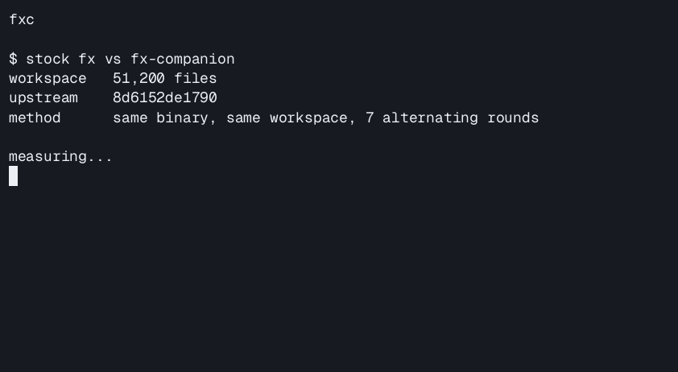
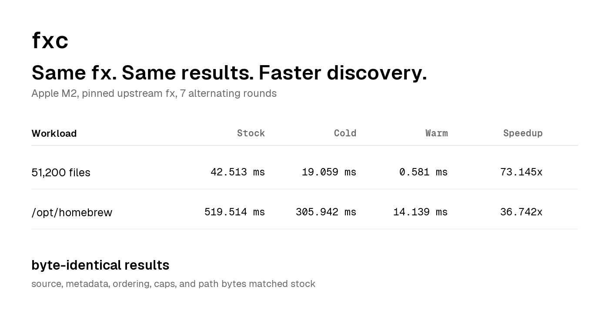

<p align="center">
  
</p>

Make fx dramatically faster on Apple Silicon. Same fx. Same results. No fork.

<p align="center">
  <a href="https://github.com/ChloeVPin/fx-companion/actions/workflows/benchmark.yml"></a>
  <a href="https://github.com/ChloeVPin/fx-companion/actions/workflows/ci.yml"></a>
</p>

`fx-companion` builds the real upstream [Vercel `fx`](https://github.com/vercel-labs/fx), adds a small Apple Silicon workspace-discovery accelerator, and keeps stock `fx` in control of behavior and results.

<p align="center">
  
</p>

## Install

On macOS Apple Silicon:

```sh
npx github:ChloeVPin/fx-companion#v0.4.1
```

Then run `fx` exactly as you already do.

Check the install:

```sh
npx github:ChloeVPin/fx-companion#v0.4.1 status
```

The npm package metadata is ready for the shorter `npx fx-companion` command,
but the registry package is not published yet. The README will switch to that
command only after the package is live.

The stock escape hatch is always available:

```sh
FX_NO_COMPANION=1 fx
```

## Why trust it

- **Same upstream `fx`.** This is an additive build of the pinned upstream source, not a replacement CLI and not a long-lived fork.
- **Same results.** The release gate compares stock and accelerated discovery byte-for-byte, including ordered paths and result metadata.
- **Fail closed.** If the companion cannot prove an exact accelerated result, the request stays on the stock path.

## Measured on Apple M2

Current accelerator-core validation on Apple M2, 8 cores, 8 GiB RAM, macOS 27, Zig 0.16.0, pinned to `fx` commit `8d6152de17905429ad78decdb475df8cfd04f557`:

| Workload | Stock median | Companion cold | Companion warm | Warm speedup |
| --- | ---: | ---: | ---: | ---: |
| 51,200-file synthetic tree | 42.513 ms | 19.059 ms | 0.581 ms | 73.145x |
| `/opt/homebrew`, 161,771 paths | 519.514 ms | 305.942 ms | 14.139 ms | 36.742x |

Every result in these runs was byte-identical to stock, including source, cap, incomplete and cap-reason metadata, overlong counts, ordered paths, and path bytes.

<p align="center">
  
</p>

Full methodology, raw measurements, and reproduction notes are in [`benchmarks/README.md`](benchmarks/README.md) and [`benchmarks/results/`](benchmarks/results/).

The discovery numbers above measure the stage fx-companion actually accelerates.
They are not claimed as whole-app startup speedups. A separate PTY benchmark of
the real release binary measured process start to fx's own file-index-ready
milestone at 624.530 ms stock vs 617.566 ms companion warm on the 51,200-file
fixture, and 951.448 ms vs 907.892 ms on a 409,600-file fixture where fx indexed
its 100,000-candidate cap. See the
[`launch-readiness measurements`](benchmarks/results/2026-09-07-launch-readiness.md)
for the full methodology and machine-readable evidence.

## How it works

`fx-companion` accelerates only the workspace-discovery paths where equivalence can be proven:

- Normal tracked Git workspaces cache the raw `git ls-files` output across separate `fx` processes, then feed those exact bytes back through upstream parsing and acceptance policy.
- Sorted recursive discovery can reuse a validated snapshot only when every visited directory was captured during the accelerated walk.
- Traversal participation is selected from Apple Silicon performance-core topology and the workload exposed by the seed scan. Buffer sizing uses measured 128 KiB and 256 KiB tiers.
- Source-order requests, capped first-N cases where order can become observable, untracked Git modes, Git environment overrides, unsupported platforms, and disabled-cache paths stay stock.

The source boundary is pinned in [`PINNED_FX`](PINNED_FX). Cache identity also includes a SHA-256 fingerprint of pristine upstream workspace-discovery source so snapshots cannot silently cross an upstream semantic change.

## Compatibility and safety

- Supported product target: macOS on Apple Silicon (`arm64`). Other platforms use stock `fx` or are rejected by the installer.
- Release builds clone Vercel `fx`, check out [`PINNED_FX`](PINNED_FX), inject the companion, run equivalence probes, then package the binary.
- Every pull request and `main` push runs stock-vs-companion differential tests plus Git identity, empty-Git fallback, environment and limit bypass, concurrent-cache, cross-process writer, and corrupt-snapshot recovery checks. Release CI repeats the larger gate before packaging.
- Persistent snapshots carry an explicit schema and semantic ABI, upstream source fingerprint, SHA-256 payload checksum, atomic same-directory publication, and bounded disk pruning.
- `FX_COMPANION_NO_CACHE=1` disables snapshots. `FX_NO_COMPANION=1` disables all acceleration.
- A failed source build keeps the previously installed binary. A failed release validation does not retire the existing stock executable.
- The installer does not read, move, or replace `~/.fx` sessions, chats, skills, or settings.

Rollback:

```sh
FX_NO_COMPANION=1 fx
rm -f "$HOME/.fx-companion/bin/fx"
```

## Direct source install

If you prefer the source bootstrap path:

```sh
curl -fsSL https://raw.githubusercontent.com/ChloeVPin/fx-companion/v0.4.1/bootstrap.sh | sh
```

Review installers before running them. The release-first installer verifies the exact archive against `SHA256SUMS`, validates the archive shape and companion marker, and installs only inside `~/.fx-companion`. If the exact release is unavailable, it builds from the immutable source bundle shipped with the package. The source fallback requires Zig 0.16+, Git, Python 3, and Node.js 18+.

## Development

The shipped accelerator is in [`product/`](product/). Benchmark and profile runners live under [`benchmarks/tooling/`](benchmarks/tooling/) and are never injected into the `fx` UI or command surface. The standalone daemon, Mach clients, ZeroCopyState experiment, and traversal shootouts in [`src/`](src/) and [`benchmarks/`](benchmarks/) are retained research and measurement tooling, not runtime dependencies for the installer.

```sh
zig build test
zig build
zig build bench
node product/cli_smoke_test.js
```

To reproduce the pinned upstream discovery benchmark, use a read-only clone containing `PINNED_FX`:

```sh
FX_UPSTREAM_REPO=/path/to/vercel-labs/fx \
  benchmarks/run_discover_bench.sh /path/to/tree 7 600000
```

The project is unofficial, Apache-2.0 licensed, and not affiliated with Vercel.
