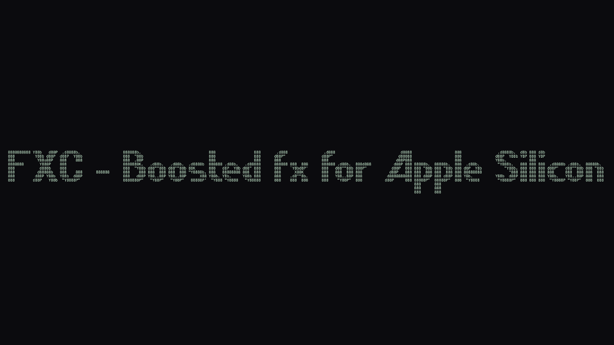

<p align="center">
  
</p>

---

## Install

One command. It downloads a prebuilt binary (checksum verified), retires any
stock `fx` you already have — your sessions, skills, and settings are never
touched — and links it onto your PATH.

Before installing anything, the installer runs an equivalence test: boosted
output must be byte-identical to stock on a known tree. If it isn't, nothing
is installed.

**Requirements:** macOS on Apple Silicon, Node 18+.

## What it does

fx walks your workspace on every turn of its agent loop — single threaded,
2 KB buffer, one directory at a time. fx-companion replaces that inner loop
with an eight-worker pool over the same syscalls and 128 KB buffers.
Everything else is stock fx, unchanged.

The booster is purely additive: unsupported platform, any hard failure, or
`FX_NO_COMPANION=1` falls back to the stock walk automatically.

## Performance

Measured on macOS arm64, ReleaseFast, medians of timed runs after warmup.
Reproduce with [`product/tests_fxcompanion.zig`](product/tests_fxcompanion.zig).

| Surface | Stock | Boosted | Speedup |
|---|---:|---:|---:|
| Workspace walk, end to end (409,600 files) | 1,589–1,685 ms | 347–533 ms | **3.2–4.6×** |
| Raw traversal | 213 ms | 104 ms | **2.05×** |

In any session, `/benchmark` runs raw speed tests on your current workspace:
stock-equivalent vs accelerated walk, seven rounds each, median and best.

## Updating

Every release is built in public CI from vercel-labs/fx at a pinned commit,
gated by the equivalence test before anything is published. To move to a new
release, run the same install command again. To check what you're running:

```sh
npx github:ChloeVPin/fx-companion status
```

## Independence

fx-companion is fully self-governed. We read vercel-labs/fx as pinned source;
we never open issues or pull requests there, never contact the fx team, and
never modify their repositories. Updating happens on our schedule, tested
before it reaches you — if an upstream change ever breaks a non-essential
hook, only that feature is skipped, loudly, and the speed booster still works.

## FAQ

<details>
<summary><b>Is this a fork?</b></summary>

No. Each release builds vercel-labs/fx unmodified plus one additive module
with a graceful fallback. Remove the module and you have exactly stock fx.
</details>

<details>
<summary><b>How do I go back to stock?</b></summary>

Restore the `.stock.bak` binary the installer left beside your old one, delete
`~/.fx-companion/bin/fx`, or run `FX_NO_COMPANION=1 fx …` per invocation.
</details>

<details>
<summary><b>Does it work on Intel Macs or Linux?</b></summary>

Not yet — the fast path targets macOS arm64 syscalls. Everything else falls
back to stock behavior.
</details>

<details>
<summary><b>Where is my data?</b></summary>

Right where it was. Sessions, chats, skills, and settings in `~/.fx` are never
read, moved, or modified by the installer.
</details>

## Credits & license

<div align="center">

Apache-2.0 · © 2026 ChloeVPin — the fx-companion accelerator

Built on [fx](https://github.com/vercel-labs/fx) by Vercel Labs, Inc. · Apache-2.0

Unofficial project, not affiliated with or endorsed by Vercel. See [NOTICE](NOTICE).

</div>
